# Use Case Diagram

```mermaid
graph TB
    %% Актори
    User[Користувач]
    AITrainer[AI Тренер]
    Firebase[Firebase]
    
    %% Use Cases
    Register[Реєстрація]
    Login[Вхід в систему]
    CreateProfile[Створення профілю]
    EditProfile[Редагування профілю]
    GenerateWorkout[Генерація плану тренувань]
    StartWorkout[Початок тренування]
    LogExercise[Логування вправ]
    CompleteWorkout[Завершення тренування]
    WellnessCheck[Wellness Check]
    AdaptWorkout[Адаптація тренування]
    ChatWithTrainer[Спілкування з тренером]
    ViewProgress[Перегляд прогресу]
    AnalyzeProgress[Аналіз прогресу]
    SaveData[Збереження даних]
    AuthenticateUser[Автентифікація]
    
    %% Зв'язки користувача
    User --> Register
    User --> Login
    User --> CreateProfile
    User --> EditProfile
    User --> GenerateWorkout
    User --> StartWorkout
    User --> LogExercise
    User --> CompleteWorkout
    User --> WellnessCheck
    User --> ChatWithTrainer
    User --> ViewProgress
    
    %% Зв'язки AI Тренера
    AITrainer --> GenerateWorkout
    AITrainer --> AdaptWorkout
    AITrainer --> AnalyzeProgress
    AITrainer --> ChatWithTrainer
    
    %% Зв'язки Firebase
    Firebase --> SaveData
    Firebase --> AuthenticateUser
    
    %% Include відношення
    Register -.->|include| AuthenticateUser
    Login -.->|include| AuthenticateUser
    CreateProfile -.->|include| SaveData
    EditProfile -.->|include| SaveData
    LogExercise -.->|include| SaveData
    CompleteWorkout -.->|include| SaveData
    
    %% Extend відношення
    WellnessCheck -.->|extend| AdaptWorkout
    GenerateWorkout -.->|extend| AdaptWorkout
    CompleteWorkout -.->|extend| AnalyzeProgress
```

## Опис Use Cases

### Основні сценарії використання:

**1. Автентифікація та профіль**
- Реєстрація нового користувача
- Вхід в систему існуючого користувача
- Створення та редагування персонального профілю

**2. Планування тренувань**
- Генерація персоналізованого плану тренувань
- Wellness check для адаптації тренування
- Адаптація плану на основі самопочуття

**3. Виконання тренувань**
- Початок тренувальної сесії
- Логування виконаних вправ
- Завершення тренування з аналізом

**4. Моніторинг та аналіз**
- Перегляд історії тренувань
- Аналіз прогресу через AI
- Спілкування з AI тренером

### Актори:

**Користувач** - основний актор, який взаємодіє з системою для тренувань

**AI Тренер (Google Gemini)** - надає інтелектуальні функції генерації планів та аналізу

**Firebase** - зовнішня система для автентифікації та збереження даних